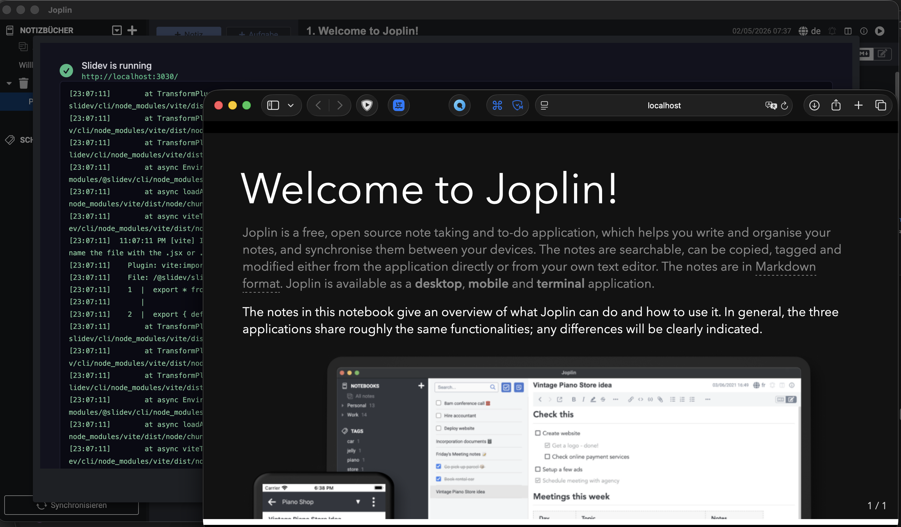
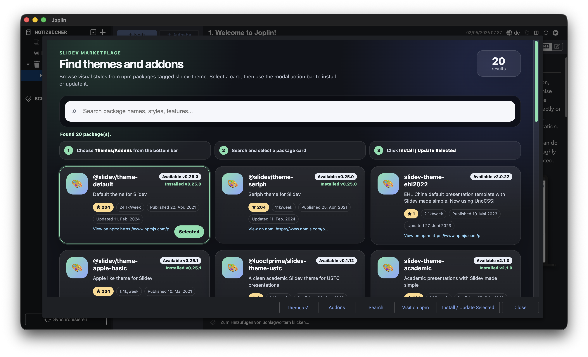

# Slidev Integration for Joplin

Create and present [Slidev](https://sli.dev/) slide decks directly from Joplin notes.

Write your slides in Joplin, start a local Slidev presentation, open presenter or overview mode, install Slidev themes/addons, and export decks to PDF, PowerPoint, PNG, or a portable Markdown/resources bundle.

## Highlights

- Start a Slidev presentation from the selected note.
- Keep Joplin as the source of truth for slide content and presenter notes.
- Open Slides, Presenter, or Overview mode from the startup dialog.
- Choose whether a browser window opens automatically.
- Add slide numbers, a progress bar, or both.
- Install Slidev themes and addons from npm inside Joplin.
- Export to PDF, PowerPoint, PNG images, or Markdown with resources.
- Use Joplin attachments in slides, including images, audio, video, and PDFs.

## Requirements

- Joplin Desktop `3.5.11` or newer.
- Node.js and npm available to Joplin.
- Internet access on first use so the plugin can install Slidev into its local workspace.

The plugin installs Slidev into Joplin's plugin data directory. Your notes are not moved, and Joplin remains the place where you edit slide content.

## Quick Start

1. Select a note in Joplin.
2. Click the Slidev toolbar button or use `View -> Start Slidev Presentation`.
3. Wait for first-time setup if Slidev has not been installed yet.
4. Use the dialog buttons to open `Slides`, `Presenter`, or `Overview`.
5. Close the dialog when you want to stop the local Slidev server.

On first start, setup can take a little while because npm installs Slidev and the default themes. Later starts reuse the local workspace.



## Writing Slides

Use normal Slidev Markdown in a Joplin note:

```markdown
---
theme: seriph
title: My Presentation

---

# First Slide

Hello from Joplin.

---

# Second Slide

- Works with Slidev Markdown
- Uses your note frontmatter
- Can include Joplin attachments
```

If a note already has Slidev frontmatter, the plugin respects it. Settings such as default theme, color schema, aspect ratio, and line numbers are only injected when the note does not already define that option.

The `Slide number` setting controls whether slides show a page counter and where it appears. Override it per presentation with the `slideNumber` frontmatter key:

| `slideNumber` value | Effect                                           |
|---------------------|--------------------------------------------------|
| *(empty/absent)*    | Use the plugin setting or Slidev default         |
| `none`              | Hide the page counter                            |
| `top-left`          | Show the page counter in the top-left corner     |
| `top-right`         | Show the page counter in the top-right corner    |
| `bottom-left`       | Show the page counter in the bottom-left corner  |
| `bottom-right`      | Show the page counter in the bottom-right corner |

The `Progress bar` setting controls whether slides show a progress bar and whether it appears at the top or bottom. Override it per presentation with the `slideProgressBar` frontmatter key:

| `slideProgressBar` value | Effect                                   |
|--------------------------|------------------------------------------|
| *(empty/absent)*         | Use the plugin setting or Slidev default |
| `none`                   | Hide the progress bar                    |
| `top`                    | Show the progress bar at the top         |
| `bottom`                 | Show the progress bar at the bottom      |

```yaml
---
theme: seriph
slideNumber: bottom-right
slideProgressBar: bottom

---
```

## Presenter Notes

Write presenter notes using Slidev's HTML comment syntax:

```markdown
# Slide With Notes

Visible slide content.

<!--
These notes appear in Presenter mode.
-->
```

Edit notes in Joplin. Notes edited inside Slidev's live UI are temporary and are not written back to Joplin.

## Attachments And Media

Joplin resource links such as `:/resourceId` are exported into the local Slidev workspace automatically.

- Images stay as Markdown images.
- Audio attachments can become `<audio controls>` players.
- Video attachments can become `<video controls>` players.
- PDF attachments can be embedded as inline previews.

Media embedding can be enabled or disabled per media type in the plugin settings.

## Opening Views

The startup dialog shows the Slidev server log and, once ready, offers:

- `Open in Browser`: normal slide view.
- `Presenter`: speaker view with presenter notes.
- `Overview`: grid view of all slides.
- `Close`: stops the local Slidev server.

The `Initial Slidev view` setting controls what opens automatically. Choose `None (use dialog buttons)` if you prefer to start the server without opening a browser window.

Advanced remote access settings map to Slidev's dev-server CLI options:

- `Enable Slidev remote access`: passes `--remote` so Slidev listens on the public host and enables remote control.
- `Presenter remote password`: passes `--remote=<password>` and requires the password before presenter mode can be opened.
- `Enable Slidev remote tunnel`: passes `--remote --tunnel` to open a Cloudflare Quick Tunnel for sharing the local server over the internet.
- `Slidev remote bind address`: passes `--bind <address>` when remote access is enabled. Leave empty to use Slidev's default `0.0.0.0`.

Enable `Presenter-controlled navigation` in advanced settings to keep the public slide view locked to the presenter. Viewers cannot advance slides locally; presenter mode and tunnel entry controls still drive the shared presentation.

## Themes And Addons

Use `Tools -> Manage Slidev Themes/Addons` to browse npm packages tagged for Slidev.



The store shows:

- Package name and available version.
- Installed version when the package is already in the Slidev workspace.
- Weekly npm downloads.
- GitHub stars when a GitHub repository can be detected.
- Published and updated dates.
- A link to the package on npm.

To install a package:

1. Open `Tools -> Manage Slidev Themes/Addons`.
2. Choose `Themes` or `Addons` from the dialog buttons.
3. Search if needed.
4. Select a package card.
5. Click `Install / Update Selected`.

Installed themes can be used immediately in note frontmatter, for example:

```yaml
---
theme: seriph

---
```

Restart Joplin only if you need the installed theme list in settings to refresh.

## Exporting

Select a single note and use Joplin's export action. The plugin adds these formats:

- `Slidev PDF`
- `Slidev PowerPoint`
- `Slidev PNG images`
- `Slidev Markdown with resources`

PDF, PowerPoint, and PNG exports use Slidev's CLI exporter. The first export may install `playwright-chromium` into the plugin's Slidev workspace because Slidev requires it for browser-based rendering.

The Markdown/resources export writes a processed `slides.md` and copied resources. It does not run Slidev's browser exporter.

## Useful Settings

Open `Tools -> Options -> Slidev Integration` in Joplin.

- `Default port`: Preferred local Slidev server port. If busy, the plugin tries following ports.
- `Default Slidev theme`: Theme used only when a note does not set `theme:`.
- `Initial Slidev view`: Automatically open Slides, Presenter, Overview, or nothing.
- `Color schema`: Use Slidev default, `auto`, `dark`, or `light` when missing from the note.
- `Aspect ratio`: Use Slidev default, `16:9`, `4:3`, or `1:1` when missing from the note.
- `Code line numbers`: Show or hide code line numbers when missing from the note.
- `Slide number`: Show a page counter (e.g. 3 / 10) and choose its position.
- `Progress bar`: Show a thin progress bar and choose top or bottom position.
- `Open Slidev workspace`: Opens the local workspace folder in your file manager.
- `Hide toolbar button`: Removes the note toolbar button while keeping the menu command.
- `Embed audio/video/PDF attachments`: Controls whether those attachment types are embedded in slides.

Advanced settings are available for wake lock, selectable text, Slidev context menu, overview snapshots, and Markdown compatibility fixes.

## Troubleshooting

### First Start Is Slow

This is expected. The plugin installs Slidev and default themes into its local workspace on first use.

### npm Or Slidev Install Fails

Make sure Node.js and npm are installed and visible to Joplin. On macOS, GUI apps sometimes have a smaller `PATH` than your terminal. Starting Joplin from a terminal can help diagnose environment issues:

```sh
open -a Joplin
```

### Theme Not Found

Install the theme through `Tools -> Manage Slidev Themes/Addons`, or use a theme already installed in the Slidev workspace. Explicit `theme:` frontmatter in a note always wins over the default theme setting.

### Port Already In Use

Change `Default port` in the plugin settings. The plugin also checks the next 100 ports after the configured value.

### A Presentation Keeps Running

Close the Slidev startup dialog to stop the server. If Joplin crashed, restart Joplin so the plugin can clean up orphaned Slidev processes.

## Development

Install dependencies:

```sh
npm install
```

Type-check:

```sh
npm run tsc
```

Build the installable plugin archive:

```sh
npm run dist
```

The build writes the `.jpl` file to `publish/io.github.moritzf.slidev-integration.jpl`.

For local testing with an isolated Joplin profile:

```sh
npm run build-and-run
```

For debugging with Electron remote debugging enabled:

```sh
npm run build-and-debug
```
